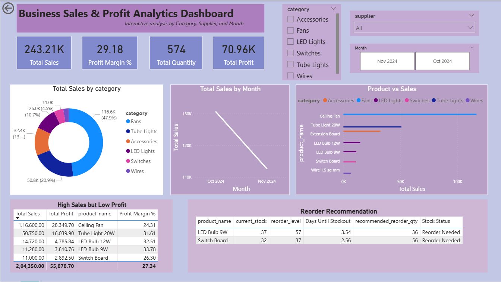

# Electrical Sales Data Analysis Project

## Project Overview

This project shows a complete data analysis workflow using Python, SQL, and Power BI.

The goal was to analyze electrical product sales data to understand sales performance, profit trends, and supplier impact. The final result is an interactive Power BI dashboard that helps in making business decisions.

---

## Tools Used

- Python (Pandas) – Data cleaning
- SQL – Data analysis and business queries
- Power BI – Dashboard creation
- DAX – KPI calculations
- Excel – Raw data source

---

## Project Structure

Electrical-Sales-Analysis/

- data/ → Raw Excel dataset  
- python/ → Data cleaning scripts  
- sql/ → SQL queries and schema  
- powerbi/ → Power BI dashboard (.pbix & PDF)  
- screenshots/ → Dashboard images  
- README.md → Project documentation  

---

## Project Steps

### 1. Data Cleaning (Python)
- Cleaned and prepared the dataset  
- Handled missing values  
- Formatted columns for analysis  

### 2. Data Analysis (SQL)
- Wrote queries to analyze:
  - Top selling products  
  - Monthly sales trends  
  - Supplier performance  
  - Profit analysis  

### 3. Dashboard Development (Power BI)

Created an interactive dashboard including:

- Total Sales KPI  
- Total Profit KPI  
- Profit Margin %  
- Top 5 Products  
- Monthly Sales Trend  
- High Sales but Low Profit products  
- Category, Supplier, and Month slicers  

---
## Dashboard Preview

## Key Insights

- Identified products with high sales but low profit  
- Analyzed monthly revenue trends  
- Compared supplier performance  
- Created interactive filters for better analysis  

---

## Skills Demonstrated

- Data cleaning and preprocessing  
- SQL querying  
- Data modeling  
- DAX measure creation  
- Dashboard design in Power BI  
- Business insight generation  

---

## Files Included

- Power BI dashboard (.pbix file)  
- PDF version of dashboard  
- Python scripts  
- SQL queries  

---

## Author

Rhythm Khanna  
Aspiring Data Analyst
